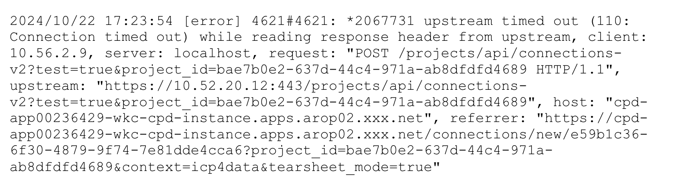
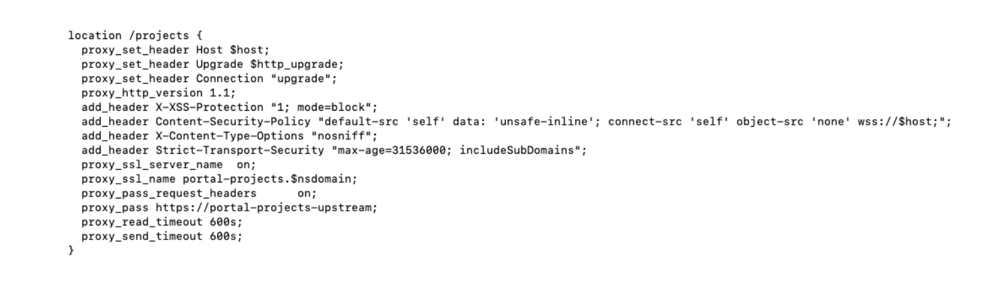

# Increase time out setting for CPD API

## 1. Identify the zen-extension to be edited

- Go into the ibm-ngix pod

```shell
oc rsh ibm-nginx-xxx
```

- Go to the nginx folder

`proxy_read_timeout`
`proxy_send_timeout`

- Identify the zen-extension to be edited using grep

Grep the zen-extension using the keyword of the API call.

For example, we can infer the “project” as the keyword from below time out error message:




Use the keyword “project” for searching the zen-extension.

```shell
grep project ./*./cpd_ws-base-zen-frontdoor-extension_ie_159.conf
```

From the result, we can tell **ws-base-zen-frontdoor-extension** is the zen-extension we should edit.

## 2. Put the relevant custom resource into maintenance mode

As the **ws-base-zen-frontdoor-extension** zen-extension belongs to CCS, we need to put CCS into maintenance mode for preventing it from being reverted back during the reconciliation.

```shell
oc patch -n ${PROJECT_CPD_INST_OPERANDS} ccs ccs-cr --type merge --patch '{"spec": {"ignoreForMaintenance": true}}'
```

## 3. Add the section to the location part

1. Have a backup of the zen-extension ws-base-zen-frontdoor-extension

    ```shell
    oc get zenextension ws-base-zen-frontdoor-extension -n ${PROJECT_CPD_INST_OPERANDS} -o yaml > ws-base-zen-frontdoor-extension.yaml
    ```

2. Edit the zen-extension ws-base-zen-frontdoor-extension

    ```shell
    oc edit zenextension ws-base-zen-frontdoor-extension -n ${PROJECT_CPD_INST_OPERANDS}
    ```

Add below time out settings to the location corresponding to the API call accordingly:

```
proxy_read_timeout 600s;
proxy_send_timeout 600s;
```

The edition looks like below:



Save the changes and wait for the zenextension to become the ‘Completed’ status.

```shell
oc get zenextension ws-base-zen-frontdoor-extension
```

```
NAME                            STATUS          AGE
ws-base-zen-frontdoor-extension Completed       19d
```

## 4. Validate the changes applied

Follow similar approaches in Step 1 and check whether the time out setting in the location of the `cpd_ws-base-zen-frontdoor-extension_ie_159.conf` is with the changes made in previous steps.