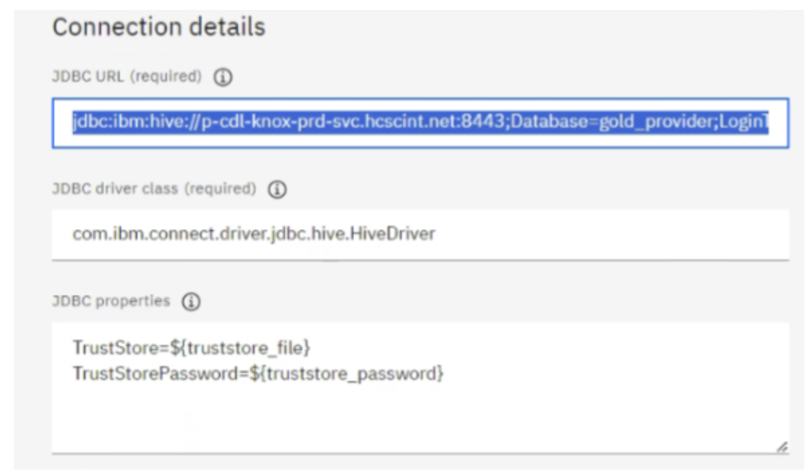
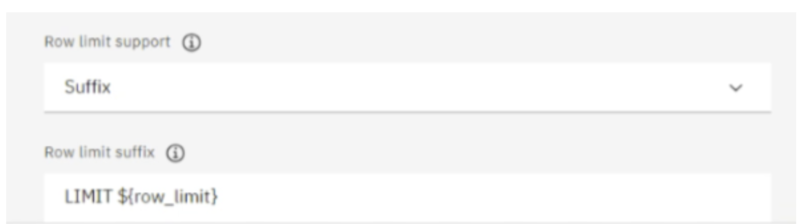

**Hive connection using Generic JDBC**

**1.Follow below documentation and navigate to the Web UI for creating the Platform Connection**

https://www.ibm.com/docs/en/cloud-paks/cp-data/4.8.x?topic=catalogs-generic-jdbc-connection

**2.Input the JDBC URL:**

If you look in the /logs/trace.log of the wdp-connect-connector pod, you should be able to find the JDBC URL that the Hive connector uses. Search for strings containing the words "will connect". That's when the connector pod logs the JDBC connection URL.

Based on the identifed JDBC connection URL, add the proper LoginTimeout setting accordingly.

jdbc:ibm:hive://p-cdl-knox-prod- svc.xxx.net:8443;Database=gold_pxxx;encrypt=false;LoginTimeout=600;QueryTimeo ut=600;Database=xxx;Schema=yyy

**3.Input the JDBC driver class:**

Use the Hive driver that CPD already bundle. No need to upload your own driver.

com.ibm.connect.driver.jdbc.hive.HiveDriver

**4.JDBC properties:**

TrustStoreLocation=${truststore_file} TrustStorePassword=${truststore_password}

**5.Row limit:**

Row limit support: Suffix
Row limit suffix: LIMIT ${row_limit}

**6.Test connection**

Validate whether the connection can complete successfully.

**7.Save the connection Reference**

**IBM Documentation:**  
[Generic JDBC Connection Guide](https://www.ibm.com/docs/en/cloud-paks/cp-data/4.8.x?topic=catalogs-generic-jdbc-connection)

**Slack Discussion:**  
[View Slack Thread](https://ibm-analytics.slack.com/archives/C07LBMXP6P5/p1729548350443139)